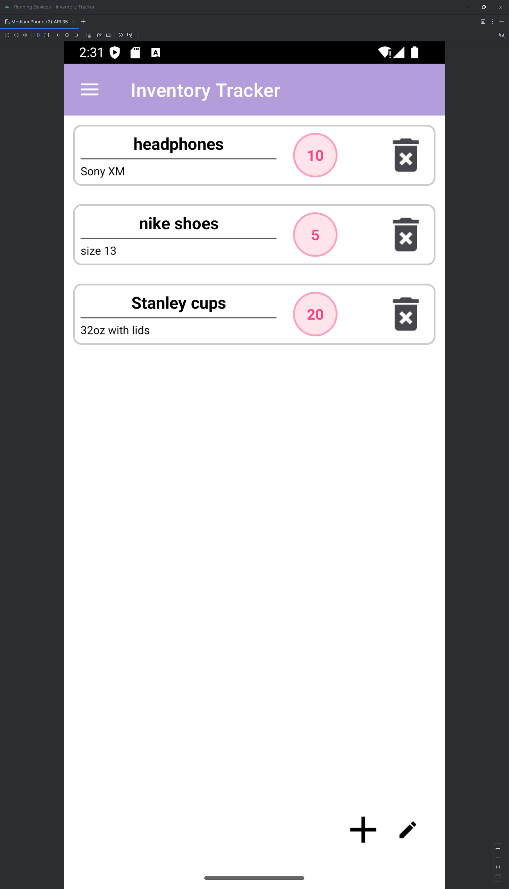
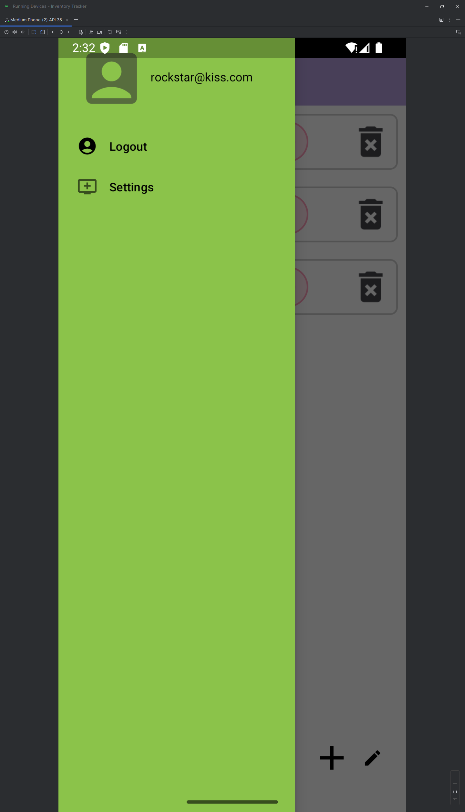

# 📓 Android Inventory Tracker — Development Journal
### Login Screen

## Project Summary

The **Inventory Tracker** app was designed to meet the needs of users managing personal or small business inventories.  
The core requirement was to **track items**, **categorize them**, and **manage user authentication** in a simple, secure, and accessible way.  
The primary user need was a **reliable**, **offline-capable**, and **intuitive** mobile application that offered easy inventory oversight without external dependencies like Firebase.

---

## Screens and Features

To meet user-centered design goals, the following key screens and features were implemented:
- **Login Screen:**  
  - Secure login using on-device database authentication
  - Create Account functionality
- **Home Menu:**  
  - Navigation to Inventory Lists
  - Accessible settings and logout options
- **Inventory List Screen:**  
  - Add, edit, and delete inventory items
  - Organize items into dynamic folders
  - Bottom navigation bar for quick actions
- **Account Menu:**  
  - View settings and logout securely
- **Navigation Drawer:**  
  - Dynamic list of inventory folders (two-level nesting)

**User-Centered UI Design Highlights:**
- Clear navigation paths and familiar mobile patterns (navigation drawer, bottom bar)
- Consistent color themes for accessibility (light and dark blue palette)
- Buttons and icons designed for easy tapping and visual clarity
- Preventive error handling (e.g., disabled buttons when not logged in)

These design choices created a user experience that felt **natural**, **low-friction**, and **task-focused**.

---

## Coding Approach and Techniques

I approached coding with a **modular, feature-first strategy**:
- Built **authentication** and **item management** separately to keep responsibilities clear
- Used **LinearLayout** and **ConstraintLayout** flexibly to create responsive UIs
- Applied **Java** for core backend logic and **XML** for view layouts
- Used **SQLite** directly instead of an ORM to maintain full control over queries and schema
- Implemented **SharedPreferences** for persistent login states
- Prioritized **early returns** and **guard clauses** to simplify control flow

These techniques can easily be reused in future projects for rapid prototyping and scalable code organization.

---

## Testing Strategy

Testing was a continuous process:
- **Unit-tested** major database operations (create, read, update, delete) with logging
- **Manually tested** login/logout flow, including bad credentials and timeout edge cases
- **Simulated UI interactions** by going through complete user journeys on device emulator
- **Stress-tested** navigation components to prevent unexpected crashes

Testing is critical because it catches small bugs before they become user-facing problems.  
This process revealed minor UI inconsistencies early and allowed me to polish the user experience significantly before finalizing the app.

---

## Innovation and Challenges

One of the biggest challenges was **managing user session persistence** without cloud-based solutions.  
I innovated by creating a **local authentication system** using SQLite and SharedPreferences, ensuring users remained logged in securely without internet access.

Another challenge was **dynamic navigation drawer updates** when new folders were added — solved through **rebuilding drawer items dynamically** based on database queries whenever needed.

These experiences taught me creative problem solving with minimal third-party libraries — keeping the app lightweight and fully in my control.

---

## Areas of Strongest Skill Demonstration

I am particularly proud of the **login system** and **inventory management** modules:
- **Authentication:** Designed, implemented, and debugged a secure local authentication flow
- **Inventory CRUD:** Full Create, Read, Update, Delete operations built cleanly with efficient database access patterns
- **UI/UX Cohesion:** Designed navigation patterns (toolbar, drawer, bottom bar) that worked intuitively together

These components demonstrated my ability to design, code, debug, and refine full application features, balancing both frontend and backend needs seamlessly.

---

# 🚀 Final Reflection

Building the Inventory Tracker app end-to-end gave me real-world experience in **mobile application architecture**, **user-centered design**, **database management**, and **secure authentication practices**.  
This project will serve as a strong foundation for future Android, Java, and mobile development work.

---

# 📸 Screenshots

  
  
  

